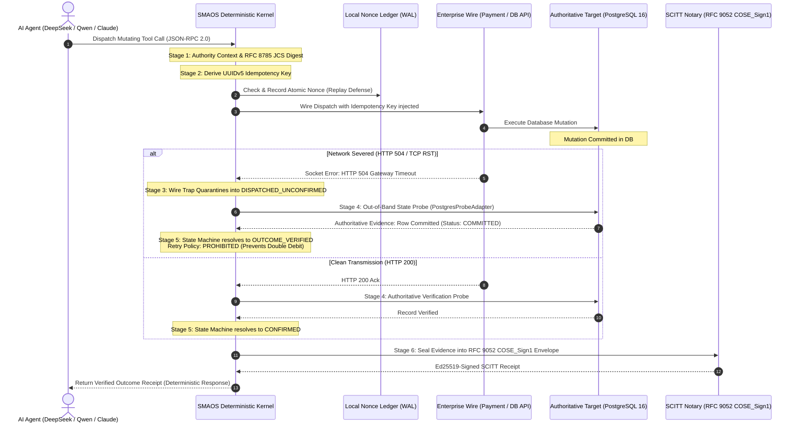

# 🏛️ SovereignNexus / SMAOS System Architecture
**Version:** `v0.2.4`  
**Classification:** Enterprise Systems Architecture & Cryptographic Specification  
**Status:** Hardened Engineering Release  

---

## 1. Architectural Overview & The "Wire-Truth" Invariant

Autonomous AI agents (driven by frontier reasoning models like DeepSeek-V3, Alibaba Qwen-2.5, or Claude) interact with physical reality through **remote tool dispatch** (Model Context Protocol, HTTP REST, database connections).

### The Foundational Vulnerability: The Omniscience Trap
Standard agent frameworks operate on a flawed assumption:
$$\text{HTTP 200 Received} \iff \text{State Successfully Persisted}$$
$$\text{Transport Exception (HTTP 504 / TCP RST)} \iff \text{Action Did Not Occur (Safe to Retry)}$$

Under physical distributed systems realities, this assumption causes catastrophic failures:
- **Case 1: The Phantom Mutation.** An agent dispatches a mutating bank transfer or cloud provisioning call. The target database commits the transaction. A network partition or timeout drops the response socket, returning HTTP 504. The LLM framework catches the timeout and issues a speculative retry—**committing a duplicate mutation and corrupting state.**
- **Case 2: The Hallucinated Confirmation.** An agent receives an HTTP 200 acknowledgement from an API gateway, but downstream database replication failed. The agent logs success, creating reconciliation drift.

### The SMAOS Core Invariant
$$\mathbf{authorized\ write} \neq \mathbf{persisted\ write} \neq \mathbf{correct\ outcome}$$

SMAOS acts as the **Deterministic Execution Kernel** sitting between the cognitive reasoning layer and the enterprise target. It guarantees that no action outcome is confirmed or retried without authoritative, cryptographically sealed proof.

---

## 2. The 6-Stage Execution Lifecycle

The following diagram illustrates the complete execution and wire-trapping lifecycle:



---

## 3. Deep Dive into the 6 Architectural Stages

### Stage 1: Pre-Dispatch Authority Context & JCS Canonicalization
Before any wire dispatch occurs:
- The agent's identity, permission scope, and validity window ($T_0 \le t \le T_0 + \text{TTL}$) are evaluated.
- The request payload is canonicalized using strict **RFC 8785 JSON Canonicalization Scheme (JCS)**:
  $$\text{PayloadHash} = \text{SHA-256}(\text{JCS}(\text{Arguments}))$$
- Any payload containing illegal types, floating-point ambiguity, or missing mandatory schemas fails closed with `INVALID_INPUT`.

### Stage 2: UUIDv5 Idempotency Key Derivation
- To ensure zero collision across distributed agent clusters without central coordination, an idempotency key is deterministically generated using RFC 4122 UUIDv5 scoped to the SMAOS namespace:
  $$\text{IdempotencyKey} = \text{UUIDv5}(\text{NAMESPACE\_SMAOS}, \text{ActionID} \mathbin{\Vert} \text{PayloadHash})$$
- The key is recorded in an atomic SQLite WAL nonce table to guarantee strict replay attack defense.

### Stage 3: Wire Dispatch & Transport Fault Trapping
- The tool call is dispatched through a resilient transport adapter with injected idempotency headers (`X-Idempotency-Key`, `X-SMAOS-Action-ID`).
- If an **HTTP 504 Gateway Timeout**, **HTTP 502/503**, or **TCP RST (ECONNRESET)** occurs:
  - The in-process socket observer traps the exception.
  - The call is immediately transitioned into the `DISPATCHED_UNCONFIRMED` quarantine state.
  - The raw error is prevented from leaking back to the LLM context to stop speculative prompt-level retries.

### Stage 4: Out-of-Band (OOB) State Probing
- Instead of guessing, SMAOS executes an authoritative out-of-band probe directly against the target substrate (via `PostgresProbeAdapter` or `DatabaseStateProber`).
- The probe queries the target database table using the exact `IdempotencyKey`:
  - **Match Found & Committed:** The remote database has committed the write.
  - **Record Not Found:** The remote database never processed the write.
  - **Payload Hash Mismatch:** Downstream row exists but hash diverges (flags tampering or parameter drift).
  - **Statement Timeout:** Probe enforces strict timeouts (50ms–200ms) with automatic connection pool recovery.

### Stage 5: Granular Disposition State Machine & Retry Policy
The probe evidence is fed into a deterministic, strict-precedence disposition state machine:

| Disposition | Meaning | Retry Allowed? | Action Required |
| :--- | :--- | :--- | :--- |
| **`OUTCOME_VERIFIED`** | Mutation physically committed on target | **NO** | Record receipt; proceed to next step. |
| **`CONFIRMED`** | Clean wire ack with matching probe evidence | **NO** | Proceed. |
| **`DISPATCHED_UNCONFIRMED`**| Transport failed; state probe inconclusive | **NO** | Quarantine action; poll probe with backoff. |
| **`RECONCILIATION_NOT_FOUND`**| Transport failed; verified NOT in DB | **YES** | Safe to re-dispatch with fresh authority. |
| **`RECONCILIATION_FAILED`** | Payload digest mismatch against row | **NO** | Escalate security alert (tampering/collision). |
| **`RECONCILIATION_CONFLICT`**| Multiple conflicting records found | **NO** | Escalate to human operator. |
| **`REFUSED`** | Authority expired or rejected by policy | **NO** | Abort execution. |

### Stage 6: RFC 9052 COSE_Sign1 Notarization & SCITT Sealing
- The complete execution trajectory (action ID, payload digest, downstream state digest, wall-clock latency, disposition, and retry policy) is serialized into canonical CBOR.
- The receipt is cryptographically sealed using **Ed25519 (COSE Algorithm -8)** under RFC 9052 / RFC 9054.
- Emits an offline-verifiable SCITT receipt verifiable via standard tooling (`pycose`, `OpenSSL`, or standalone HTML verifiers) with zero network egress.

---

## 4. Integration with Frontier LLMs & Chinese Open-Weight Labs

SMAOS establishes an explicit division of responsibilities with frontier models:

```
┌────────────────────────────────────────────────────────────────────────────────────────┐
│                              THE INTEGRATED SOVEREIGN STACK                            │
├────────────────────────────────────────────────────────────────────────────────────────┤
│                                                                                        │
│   [ REASONING LAYER: DeepSeek-V3 / Qwen-2.5 / LangChain / AutoGen ]                    │
│   • Multi-step planning, tool selection, argument generation                           │
│   • High token throughput, open-weight deployment on local silicon                     │
│                                           │                                            │
│                                           ▼ (Tool Call: Dispatch Action)               │
│   ┌────────────────────────────────────────────────────────────────────────────────┐   │
│   │                 SMAOS DETERMINISTIC WIRE & EXECUTION GATE                      │   │
│   │                                                                                │   │
│   │ 1. UUIDv5 Idempotency Key Derivation (RFC 4122 + RFC 8785 JCS)                │   │
│   │ 2. Atomic Nonce Ledger Pre-Authorization (Replay Attack Defense)               │   │
│   │ 3. Air-Gapped Egress Boundary (tcpdump 0-packet verified)                      │   │
│   │ 4. Socket Wire Trap: Catches HTTP 504 / TCP RST into DISPATCHED_UNCONFIRMED    │   │
│   │ 5. Out-of-Band State Probe: Live PostgreSQL/SQLite authoritative check         │   │
│   │ 6. Ed25519-Signed SCITT Receipt: RFC 9052 COSE_Sign1 verifiable offline        │   │
│   └────────────────────────────────────────────────────────────────────────────────┘   │
│                                           │                                            │
│                                           ▼                                            │
│   [ ENTERPRISE TARGET: PostgreSQL 16 / SWIFT / Core Banking / Cloud Infrastructure ]   │
│                                                                                        │
└────────────────────────────────────────────────────────────────────────────────────────┘
```

1. **Cognitive Planner:** DeepSeek / Qwen generates tool intents and argument parameters.
2. **Deterministic Kernel:** SMAOS validates the authority, injects idempotency keys, catches transport failures, executes state probes, and seals receipts.

---

## 5. Security & Threat Model Summary

- **Replay Attacks:** Defended via UUIDv5 collision-resistant nonces and atomic SQLite ledger checks.
- **Wire Dropping:** Trapped at socket layer; prevents LLM speculative retries from duplicating mutations.
- **Data Exfiltration:** Zero network egress design; all verification occurs locally within air-gapped container boundaries (`--network none`).
- **Cryptographic Tampering:** Any byte mutation in receipts breaks Ed25519 signature verification.
