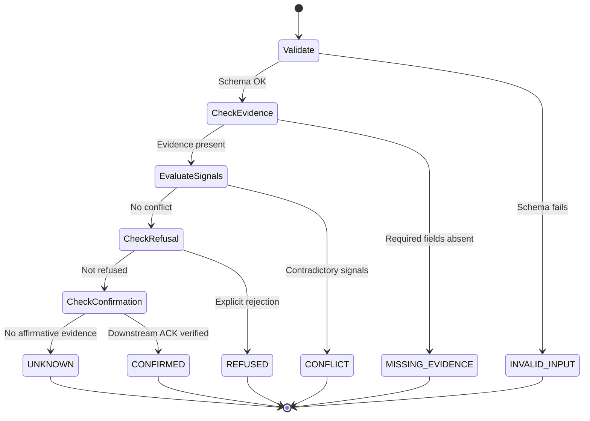

# AEI State Machine — Disposition Precedence

**Version:** 0.2.0  
**Standard:** Agent-Effect Integrity (AEI) Classification

---

## 1. Six-Disposition Cascade

The AEI state machine evaluates receipts through a strict precedence
cascade.  A disposition at a **lower** level is only reachable if all
higher-precedence checks pass:

```
INVALID_INPUT → MISSING_EVIDENCE → CONFLICT → REFUSED → CONFIRMED → UNKNOWN
     ①               ②               ③          ④          ⑤          ⑥
```

$$\text{INVALID\_INPUT} \longrightarrow \text{MISSING\_EVIDENCE} \longrightarrow \text{CONFLICT} \longrightarrow \text{REFUSED} \longrightarrow \text{CONFIRMED} \longrightarrow \text{UNKNOWN}$$

### Disposition Definitions

| # | Disposition | Definition | Example Trigger |
|:--|:------------|:-----------|:----------------|
| ① | `INVALID_INPUT` | Payload is structurally malformed or fails schema validation | Missing required `action_id` field, unparseable JSON |
| ② | `MISSING_EVIDENCE` | Payload is valid but lacks evidence required for evaluation | No `signature`, no `timestamp`, no `wire_trace` |
| ③ | `CONFLICT` | Multiple contradictory evidence signals present | HTTP 200 body says "success" but HTTP status is 409 |
| ④ | `REFUSED` | Downstream system explicitly rejected the action | HTTP 403, explicit `denied` response |
| ⑤ | `CONFIRMED` | Downstream system confirmed the state transition | HTTP 200 + matching `xid` commit in PostgreSQL |
| ⑥ | `UNKNOWN` | No affirmative evidence of effect — **fail-safe terminus** | HTTP 504 timeout, TCP RST, no response received |

---

## 2. State Transition Diagram



---

## 3. Effect-Integrity Rules

These rules cross-reference the **wire transport state** with the
**claimed disposition** to detect evidence contamination:

### Rule EI-1: Toxic Receipt Detection

> If `wire_fault ∈ {TIMEOUT, DROP}` AND `verdict ∈ {CONFIRMED, EXECUTED}`,
> then `classification = TOXIC_RECEIPT_DETECTED`.

**Rationale:** A receipt cannot legitimately claim `CONFIRMED` when
the wire transport did not deliver a response.  The harness fabricated
confirmation without downstream evidence.

### Rule EI-2: Uncertainty Preservation (Δ=0)

> If `wire_fault ∈ {TIMEOUT, DROP}` AND `verdict = UNKNOWN`
> AND `retry_held = true`, then `classification = CLEAN_PASS`.

**Rationale:** The harness correctly preserved uncertainty.  The
Δ=0 conservation invariant holds: no net state change was asserted
without evidence.

### Rule EI-3: Digest Integrity Halt

> If `jcs_digest(received) ≠ expected_digest`,
> then `classification = HALT:digest_mismatch`.

**Rationale:** The payload was modified in transit.  Execution MUST
halt ex-ante before any downstream effect is committed.

---

## 4. Reconciliation Adapters (Specified, Not Implemented)

For `CONFIRMED` to be truly confirmed in production, the harness
must verify against the actual system of record:

| System | Read-Only Probe | Confirms |
|:-------|:----------------|:---------|
| PostgreSQL | `txid_status(xid)` | Transaction committed |
| S3 | `HeadObject` → `ETag` + `VersionId` | Object written at path |
| Kafka | `committed_offsets(topic, partition)` | Message at offset |
| Stripe | `GET /charges/{id}` vs `Idempotency-Key` | Charge settled |

> **Status:** These are specified as the target architecture.
> They are NOT implemented in v0.2.0.
