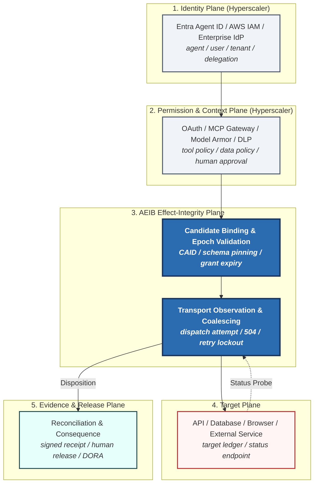

# AEIB Architecture Specification v0.1
### The Effect-Integrity Wedge Beneath Agent Identity & Gateway Controls

**Specification Status:** Review Candidate & Architecture Baseline  
**Audience:** System Architects, CISO Evaluation Teams, and Independent Verifiers  

---

## 🏛️ Executive Summary & Hyperscaler Wedge

The distinction between a general **authorization decision** and an **effect-integrity decision** is the precise architectural wedge that separates AEIB from native hyperscaler security tools:

* **Hyperscaler Identity & Policy Controls** (e.g., Microsoft Entra Agent ID, AWS Agentic AI Lens frameworks such as `AGENTSEC-02`, Google Model Armor) natively govern **who the agent is** and **what it is permitted to attempt**.
* **AEIB** natively governs **the downstream consequence when the transport fails mid-execution**.

AEIB serves as the vendor-neutral effect-integrity layer beneath agent identity and gateway controls. It cryptographically binds the exact candidate action, preserves ambiguity after transport failure, blocks speculative retries fail-closed, reconciles target state where supported, and strictly keeps release authorization separate from evidence verification.

---

## ⚙️ The 9-Stage Execution Pipeline

Modern agentic execution requires separating identity and context from transport physics and consequence:

1. **Identity**: Who is the agent, user, tenant, and delegating principal?
2. **Permission**: Which tools, resources, scopes, and credentials are available?
3. **Context and Policy**: What task, arguments, destination, data classification, and approval apply?
4. **Candidate Binding**: What exact tool, schema, arguments, destination, principal, grant, policy epoch, and Content-Addressed Action Identifier (CAID) are being proposed?
5. **Pre-Dispatch Authorization**: May this exact candidate be sent now?
6. **Transport Observation**: What actually happened on the physical wire?
7. **Effect Reconciliation**: Did the target commit, reject, remain pending, or disagree?
8. **Consequence Governance**: Is a retry permitted? Is human release required?
9. **Action Outcome**: Dispatch, hold, reconcile, or refuse.

---

## 🧩 The Architecture Sandwich

---

## 🔒 Core Binding & Boundary Controls

To prevent confused deputy attacks, policy rollback, or economic exhaustion, AEIB enforces strict bindings at the decision boundary before dispatch:

* **Delegation & Identity**: An active OAuth token is insufficient. The effect record cryptographically binds the `agent_principal`, `user_principal`, `delegation_chain`, `tenant`, `audience`, and `grant`.
* **Policy Freshness**: A candidate approved under epoch $N$ cannot execute if the environment rolls to epoch $N+1$. AEIB validates `policy_epoch`, `schema_epoch`, `grant_expiry`, and `key_epoch` at the exact millisecond of dispatch.
* **Economic Limits**: A system can be correct about transport state while still executing an economically destructive action. The boundary enforces `tenant_budget`, `per-tool_rate_limit`, `per-domain_concurrency`, and `business_amount_limit`.
* **Human Release Separation**: Confirming a successful target effect does not automatically authorize downstream business release (e.g., triggering a wire payment or publishing a document). $\text{Effect confirmation} \neq \text{Business release}$.

---

## 🎯 Target Reconciliation Semantics

AEIB’s resolution of an ambiguous transport disposition (`EFFECT_INDETERMINATE`) is strictly governed by the capabilities of the downstream target:

| Target Capability | AEIB Resolution & Claim |
| :--- | :--- |
| **Idempotency Key + Authoritative Status API** | Reconcile and potentially recover. Provides the strongest duplicate-control case via single-flight target status probes. |
| **Idempotency Key Only** | Safe retry suppression with limited outcome confirmation via idempotency token binding. |
| **Status API Only** | Reconcile, but duplicate risk may remain depending on target provider architecture. |
| **Browser-Only Workflow** | Often remains indeterminate after response loss; strict ambiguity latching is required. |
| **No Cooperation** | Preserve uncertainty fail-closed; hold and escalate to human operator. No exactly-once claim is possible. |

---

## 🛡️ Epistemic Boundary Notice

AEIB operates under the stated model as a **Review Candidate and Reproducibility Package**. AEIB does not claim universal exactly-once execution, absence of remote duplicate effects on arbitrary uncooperative endpoints, or complete prompt-injection prevention.
