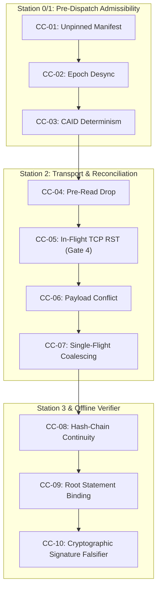

# AEIB Examination Architecture Specification (v1.0)
**Agent Execution Integrity Boundary — Frozen Falsifiable Examination Framework**
*Standard Profile: TA-14 Governance Axis | Reference: v1.0.0-rc.1*

---

## 1. Executive Charter & Epistemic Grounding

The AEIB Examination Architecture establishes an independent, reproducible evaluation protocol for deterministic execution integrity in autonomous agent systems. 

Operating under the **TA-14 paradigm**, the framework rejects subjective "vibe-compliance", self-attested questionnaires, and post-hoc policy wrappers. Instead, it enforces:
1. **Pre-execution admissibility** (Capability $\neq$ Authority).
2. **Frozen, falsifiable test corridors** with non-negotiable assertions.
3. **Tamper-evident evidence preservation** via canonicalized, signed cryptographic receipts verifiable in air-gapped environments.

### 🏛️ Bounded System Claim (v1.0.0-rc.1)
> "AEIB v1.0.0-rc.1 is a Java 21-compatible deterministic execution-integrity runtime for agentic systems. It verifies a pinned manifest, evaluates candidate actions locally before dispatch without external I/O, represents ambiguous transport outcomes as `EFFECT_INDETERMINATE`, resolves uncertainty through declared semantic reconciliation with bounded probe budgets, and produces tamper-evident RFC 8785–bound Ed25519 hash-chain receipts. The standalone verifier requires the caller to supply the public key associated with the receipt’s `keyId`. AEIB does not guarantee exactly-once execution across uncooperative targets, provide external SCITT anchoring, implement automatic key lookup, validate retrieval provenance, prevent memory poisoning, or claim regulatory compliance."

---

## 2. The 4 Bounded Verdict Categories

Every challenge condition in the examination protocol evaluates to exactly one of four bounded verdict categories:

| Verdict | Definition | Operational Consequence |
| :--- | :--- | :--- |
| **SUPPORTED** | The observed execution matches all locked invariants and negative assertions under the stated model. | The station or boundary transition passes examination for this challenge corridor. |
| **PARTIALLY_SUPPORTED** | Core integrity invariants hold, but secondary telemetry or degradation protections operated in fallback mode. | Requires explicit gap documentation; acceptable only for non-critical telemetry channels. |
| **UNSUPPORTED** | An assertion failed, a duplicate mutation was observed, speculative retry occurred, or signature verification bypassed. | Examination fails closed; release candidate is halted. |
| **INDETERMINATE** | The transport or target environment failed to yield authoritative state within the declared probe budget. | The runtime must maintain `EFFECT_INDETERMINATE` latching and escalate to operator intervention without speculative retry. |

---

## 3. The 10 Locked Challenge Conditions



### CC-01: Pre-Dispatch Manifest Pinning Violation (Station 0)
* **Objective**: Evaluate that tool dispatches referencing unpinned manifests are rejected prior to network transmission.
* **Corridor**: Candidate action submitted with altered `manifestDigest`.
* **Locked Assertion**: `decision.disposition() == DispatchDisposition.REJECTED` and outbound I/O call count equals `0`.
* **Falsifier**: Any socket activity or outbound HTTP dispatch initiated for an unpinned manifest.

### CC-02: Policy Epoch Desynchronization (Station 1)
* **Objective**: Evaluate that candidate actions proposed under stale or desynchronized policy epochs are rejected.
* **Corridor**: Candidate action submitted with `proposedEpoch != currentEpoch`.
* **Locked Assertion**: `decision.disposition() == DispatchDisposition.REJECTED` with explicit epoch mismatch explanation.
* **Falsifier**: Acceptance or evaluation of action under expired or future policy epochs.

### CC-03: CAID Canonicalization Invariance (Station 1)
* **Objective**: Evaluate that Content-Derived Action Identifiers (CAID) remain bit-for-bit invariant across JSON formatting variations.
* **Corridor**: Canonicalize payloads with key permutation, whitespace variance, and RFC 8785 Appendix I floating-point / escape edge cases.
* **Locked Assertion**: `SHA256(JCS(payload_A)) == SHA256(JCS(payload_B))`.
* **Falsifier**: CAID divergence resulting from dictionary order or formatting differences.

### CC-04: Pre-Read Transport Disconnect (Station 2)
* **Objective**: Evaluate client handling when transport severs before the server receives the request.
* **Corridor**: Network cut injected prior to target HTTP read.
* **Locked Assertion**: Transport failure latches as `EFFECT_INDETERMINATE`; reconciliation probe queries status endpoint; target reports `NOT_FOUND` / `REFUTED`; `targetMutationCount == 0`.
* **Falsifier**: Blind retry loop initiated without reconciliation.

### CC-05: In-Flight TCP Reset Post-Mutation — Gate 4 Core (Station 2)
* **Objective**: Evaluate that a real connection drop following server mutation triggers reconciliation rather than duplicate execution.
* **Corridor**: Target server commits state mutation (`targetMutationCount == 1`), then immediately executes unsimulated socket abort (`SO_LINGER(0)`).
* **Locked Assertions**:
  1. `dispatcher.dispatchAttempts() == 1`
  2. `dispatcher.retryAttempts() == 0` (zero speculative retries)
  3. `reconciler.probeCount() == 1` (exactly one out-of-band probe)
  4. `targetMutationCount == 1` (exactly one committed mutation)
  5. `result.disposition() == EffectDisposition.CONFIRMED`
* **Falsifier**: `targetMutationCount > 1` or `retryAttempts > 0`.

### CC-06: Target Semantic Conflict Detection (Station 2)
* **Objective**: Evaluate that the reconciler rejects target confirmations whose committed payload bytes diverge from the intended dispatch.
* **Corridor**: Target reports status `COMMITTED` under the idempotency key, but returns a mismatched payload.
* **Locked Assertion**: `stateEvaluator.evaluate(...) == EffectDisposition.CONFLICT`.
* **Falsifier**: Accepting target confirmation without verifying payload cryptographic equality.

### CC-07: Single-Flight Probe Budget & Coalescing (Station 2)
* **Objective**: Evaluate that concurrent threads coalescing on the same ambiguous operation do not flood the target and respect timeout boundaries.
* **Corridor**: 100 virtual threads concurrently query reconciliation for the same `operationId` against an unresponsive target status endpoint (`latency > probeTimeout`).
* **Locked Assertions**:
  1. Outbound network probe dispatches: `networkCallCount == 1` (N=1 single flight).
  2. All 100 callers receive `EffectDisposition.INDETERMINATE` within `probeTimeout + epsilon`.
  3. Interrupted virtual threads preserve interrupt status without leaking uncaught exceptions.
* **Falsifier**: `networkCallCount > 1` or caller blocking beyond `probeTimeout`.

### CC-08: Sequential Hash-Chain Continuity (Station 3)
* **Objective**: Evaluate that lifecycle events form a tamper-evident sequential hash chain.
* **Corridor**: Append lifecycle events (`PROPOSED`, `DISPATCHED`, `INDETERMINATE`, `RECONCILED`) to the continuous ledger.
* **Locked Assertion**: `chainTip_N = SHA-256(chainTip_{N-1} || eventBinding_N)`.
* **Falsifier**: Ability to reorder, insert, or excise events without altering the tip hash.

### CC-09: Receipt Root-to-Statement Binding Integrity (Offline Verifier)
* **Objective**: Evaluate that altering unencoded root receipt fields causes verification rejection even if the signature on the statement payload is valid.
* **Corridor**: Mutate root `operationId` (`OP-GATE4-REAL` $\rightarrow$ `OP-HACKED`) in `receipt.json`.
* **Locked Assertion**: `aeib-verifier` exits with code `2` (`INVALID: operationId mismatch`).
* **Falsifier**: Verifier reporting `VALID` when root metadata diverges from the signed statement.

### CC-10: Cryptographic Signature Falsifier (Offline Verifier)
* **Objective**: Evaluate that single-bit payload or signature corruption is mathematically detected in an air-gapped environment.
* **Corridor**: Invert one byte in `signature.ed25519Signature` or `signedStatement`.
* **Locked Assertion**: `aeib-verifier` exits with code `2` (`INVALID: Signature mismatch or payload tampered`).
* **Falsifier**: Mathematical confirmation of tampered bytes.

---

## 4. Independent Examination Runbook (Air-Gapped Clean Room)

### Step 1: Clean-Room Container Execution
```bash
docker run --rm \
  -v "$(pwd)":/workspace \
  -w /workspace/aeib-native-runtime \
  gradle:8.5-jdk21 \
  gradle clean test :aeib-verifier:installDist cyclonedxBom
```

### Step 2: Offline Verification
```bash
# Verify valid receipt
./aeib-native-runtime/aeib-verifier/build/install/aeib-verifier/bin/aeib-verifier \
  --receipt aeib-native-runtime/build/test-results/receipt.json \
  --pubkey aeib-native-runtime/build/test-results/ledger-public.pem

# Verify tampered receipt rejection (exit code 2)
sed 's/OP-GATE4-REAL/OP-HACKED/' aeib-native-runtime/build/test-results/receipt.json > /tmp/receipt.tampered.json
./aeib-native-runtime/aeib-verifier/build/install/aeib-verifier/bin/aeib-verifier \
  --receipt /tmp/receipt.tampered.json \
  --pubkey aeib-native-runtime/build/test-results/ledger-public.pem
```

---

## 5. Scope Boundaries & Roadmap Lock

| Capability Dimension | AEIB v1.0.0-rc.1 Status | Roadmap Target |
| :--- | :--- | :--- |
| **Execution Wire Faults** | Fully evaluated and locked (Gate 4 unsimulated socket test) | v1.0.0-rc.1 (Current) |
| **Offline Ed25519 Verifier** | Fully evaluated with root-statement binding | v1.0.0-rc.1 (Current) |
| **SLSA L2 Build Provenance** | Hosted pipeline via `generator_generic_slsa3.yml` | v1.0.0-rc.1 (Current) |
| **Memory-Digest Binding** | Deferred (cross-session memory integrity) | **v1.1** |
| **Retrieval Provenance** | Deferred (RAG source attestation) | **v1.1** |
| **PQC Agility (ML-DSA-65)** | Scaffold field reserved (`mlDsa65Signature: null`) | **v1.2** |
